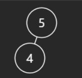

## [112. Path Sum](https://leetcode.com/problems/path-sum/description/ "Title")

### 題目
給予一棵二元數，將root到leaf路徑上的值加總，檢查是否有任何路徑等於target。

### 解題步驟
1. 每個node都從左子樹開始，使用遞迴檢查從根結點到leaf的加總是否等於target，若左子樹都不滿足，接著尋找右子樹，若是左右子樹皆無法滿足，代表從這個節點經過的路徑都無法達成target，回傳false。
2. 最糟的情況是每個節點走過一遍，時間複雜度是O(N)。

### 程式實作

```javascript
var hasPathSum = function(root, targetSum) {
    if (!root) return false;

    function findTarget(node, sum) {
        if (!node) {
            return false;
        }

        sum += node.val;

        if (!node.left && !node.right) {
            return sum === targetSum;
        }

        return findTarget(node.left, sum) || findTarget(node.right, sum);
    }

    return findTarget(root, 0);
};
```


### 備註
我在一開始這樣寫：
```javascript
var hasPathSum = function(root, targetSum) {
    if (!root) return false;

    function findTarget(node, sum) {
        if (!node) {
            return sum === targetSum;
        }

        return findTarget(node.left, sum + node.val) || findTarget(node.right, sum + node.val);
    }

    return findTarget(root, 0);
};
```

沒有考慮到這種情況：  

  

如果只有一個leaf node，將導致錯誤。